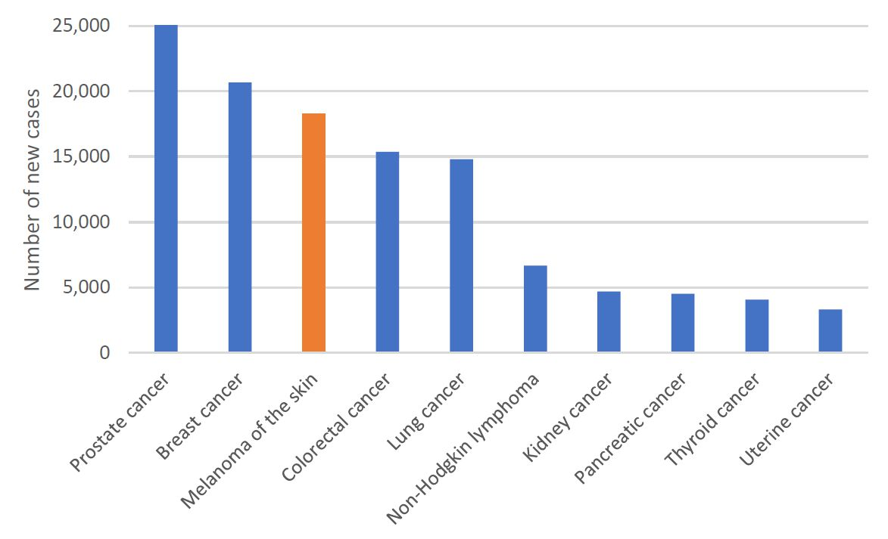
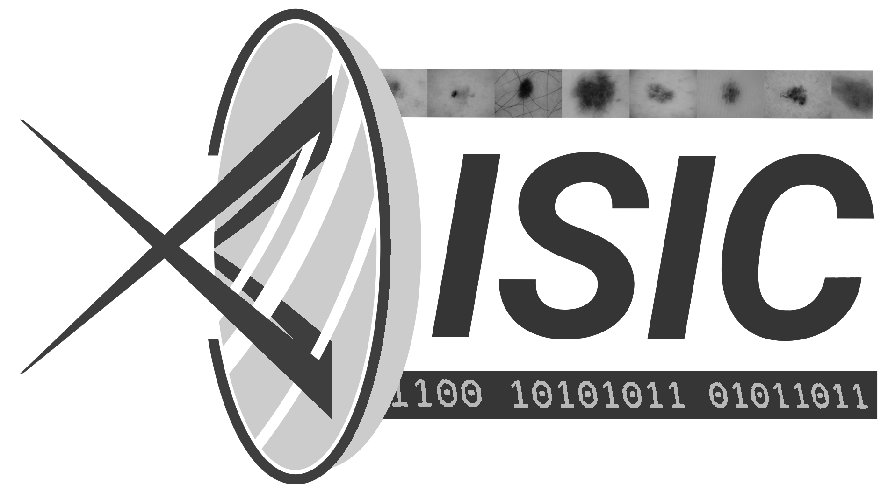
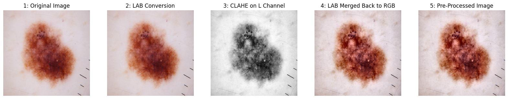
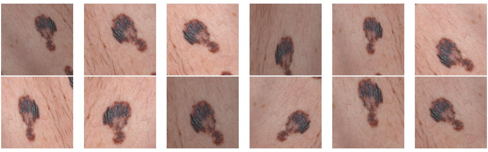
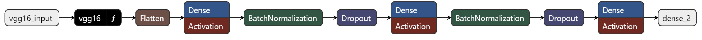
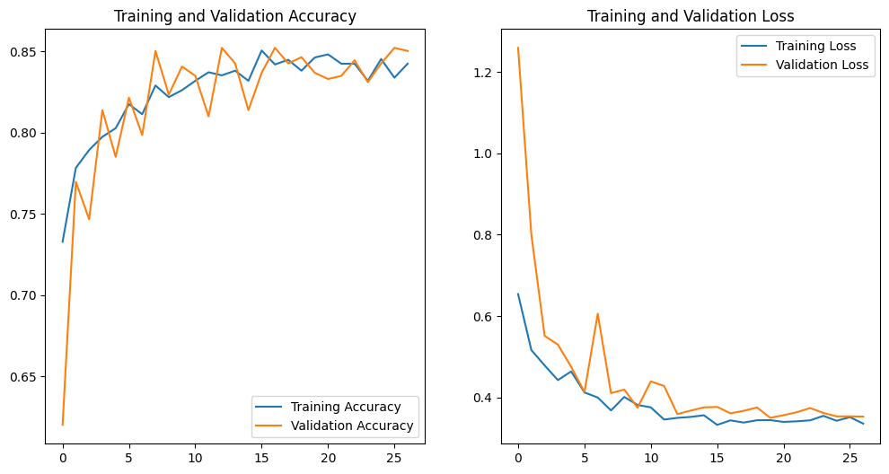
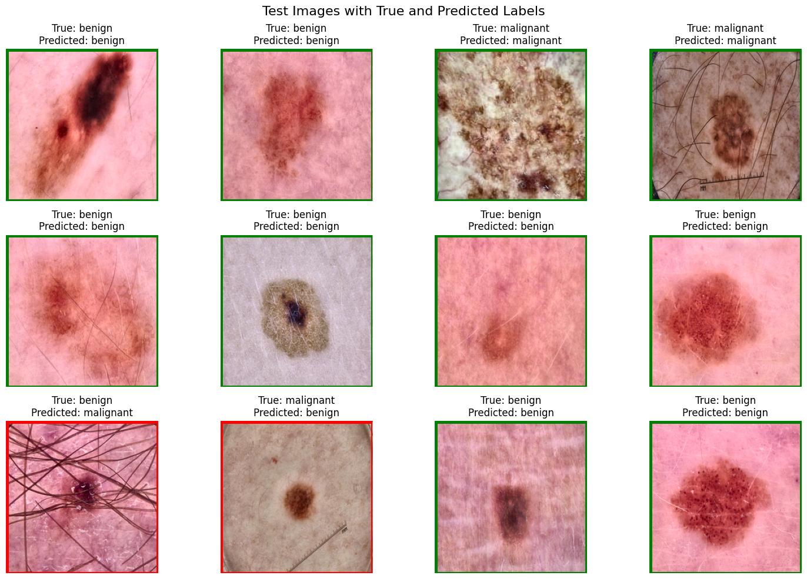

# 🩺 Automated Skin Lesion Detection using Deep Learning

**An AI-Powered Solution for Early Diagnosis of Malignant and Benign Skin Lesions**

---

## 🚀 Project Overview

Skin cancer remains one of the deadliest forms of cancer worldwide, with millions of cases diagnosed annually. Early detection is **crucial** for effective treatment and improved patient outcomes. This project aims to provide a robust, high-accuracy classifier using **deep learning techniques** to distinguish between **malignant** (cancerous) and **benign** (non-cancerous) skin lesions.

Our solution leverages a combination of **Convolutional Neural Networks (CNN)** and advanced preprocessing techniques to analyze skin images and assist healthcare professionals in making timely diagnoses.

---

## 📊 Key Features

- **High Accuracy Classification**: Efficiently distinguishes between malignant and benign lesions.
- **Preprocessing with CLAHE**: Enhanced contrast for clearer feature extraction.
- **Data Augmentation**: Increases model robustness with techniques like rotation, zoom, and flipping.

---

## 🛠️ Tech Stack

- **Python** 
- **TensorFlow / Keras** 
- **OpenCV** 
- **VGG16 Model** 

---

## 🗂️ Dataset

The dataset used for this project was sourced from **Kaggle** and is based on the **ISIC Archive**. It consists of **3263 images** of skin lesions, categorized into **malignant** and **benign** classes:

- **Training Set**: 2609 images
- **Testing Set**: 654 images
- **Image Size**: 224x224 pixels

### Preprocessing Pipeline:
- **Original Image**: The raw skin lesion image before any preprocessing steps.
- **LAB Conversion**: The image is converted to the LAB color space to separate luminance from color information.
- **CLAHE on L Channel**: Contrast Limited Adaptive Histogram Equalization (CLAHE) is applied to the L (luminance) channel to enhance contrast.
- **LAB Merged Back to RGB**: The processed LAB image is converted back to the RGB color space.
- **Pre-Processed Image**: The final enhanced image, ready for analysis or model input.

### Data Augmentation Techniques:
- **Rescaling**: Normalizes pixel values
- **Rotation, Shear, Zoom**: Enhances variability
- **Flipping**: Improves model generalization

---

## ⚙️ Model Architecture

The deep learning model leverages a **VGG16 backbone** for robust feature extraction, followed by a custom classifier:

- **VGG16 Feature Extractor**: The model utilizes the pre-trained VGG16 network as a base, capturing rich, hierarchical features from the input images.
- **Flatten Layer**: Flattens the output from the VGG16 feature maps, transforming it into a 1D vector.
- **Fully Connected Layers**: Three dense layers with 512 neurons each, designed for high-level feature learning and complex pattern recognition.
- **Batch Normalization**: Applied after each dense layer to standardize the activations, stabilize training, and accelerate convergence.
- **Dropout Regularization**: Dropout layers with a 50% rate are used to prevent overfitting by randomly disabling neurons during training.
- **Output Layer**: A single neuron with a sigmoid activation function for binary classification (benign vs. malignant).

---

## 🧠 Training Process

The model was trained for **100 epochs** using the **Adam optimizer** with a learning rate of 0.001. Key training strategies included:

- **Early Stopping**: Prevents overfitting by monitoring validation loss
- **Learning Rate Reduction**: Automatically reduces learning rate when validation loss plateaus

---

## 🏆 Results

Despite challenges like overfitting and prolonged training times, the model achieved:

- **Training Accuracy**: 85%
- **Validation Accuracy**: 86%
- **Test Accuracy**: 74%

The final model demonstrates promising potential for assisting in clinical diagnostics.

---

## 📈 Performance Visualization

Our model's predictions on test images are displayed with both **true labels** and **predicted labels** for a comprehensive assessment of model performance. The green border indicates correct predictions, while the red border highlights incorrect classifications.

This visual comparison helps in understanding the model’s accuracy and areas where it may need improvement.

---

## 💡 Future Enhancements

- Explore other CNN architectures like **ResNet**, **DenseNet**, and **InceptionNet** for improved accuracy.
- Expand the dataset with more diverse and real-world clinical images.
- Integrate the model into a **web-based application** for easier accessibility by healthcare professionals.

---

## 🤝 Contributing

We welcome contributions to enhance the model and expand its capabilities. If you have ideas for improving the project, please feel free to submit a **pull request** or **open an issue**.

---

## 📄 License

This project is licensed under the **MIT License** - see the [LICENSE](LICENSE) file for details.

---

## 📞 Contact

For questions, suggestions, or feedback, please reach out to the project team:

- Damir Tassybayev (tassybayev.kostanay@gmail.com)
- Artur Kadyrzhanov
- Zhansaya Orazbay
- Dias Nursultan
- **Supervisor**: Prof. Daniele Pannone (daniele.pannone@uniroma1.it)

---

## 🌐 References

- [Kaggle Skin Cancer Dataset](https://www.kaggle.com/datasets/fanconic/skin-cancer-malignant-vs-benign)
- [ISIC Archive](https://www.isic-archive.com)
- [VGG16 Paper](https://arxiv.org/abs/1409.1556)

Together, we can advance the fight against skin cancer and help save lives with the power of **artificial intelligence**.
